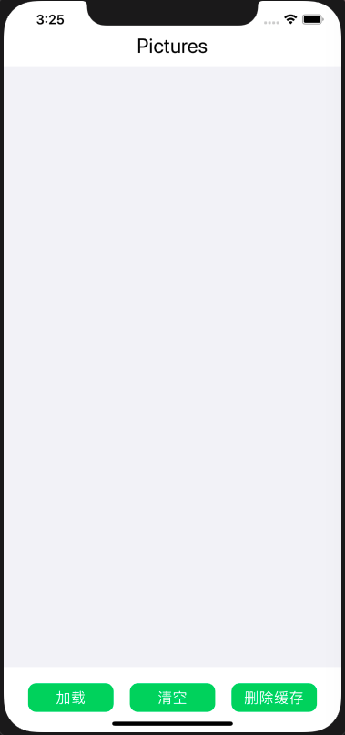

## MOSAD_HW4
### 介绍

个人作业4 - 多线程和本地存储


###  开发环境

* Mac OS
* Objective-C
* Xcode

DeadLine: 


### 任务

###  多线程与本地存储

---

### 实验目的

1. 学习使用NSOperation或GCD进行多线程操作

2. 学习iOS沙盒机制，进行文件读写操作


### 实验内容

实现一个简单的图片浏览应用，页面如下：

|            初始状态             |            加载图片             |
| :-----------------------------: | :-----------------------------: |
|  |  |

manual中有演示视频，要求如下：

1. 只有一个页面，包含一个Label，一个图片列表（可以用UICollectionView或UITableView），以及三个按钮（"加载" "清空" "删除缓存"）。
2. 点击"加载"按钮，若Cache中没有缓存的文件，则加载网络图片并显示在图片列表中，要求：
   - 在子线程下载图片，返回主线程更新UI
   - 图片下载完成前，显示loading图标
   - 图片下载后，存入沙盒的Cache中
3. 点击"加载"按钮，若Cache中已存在图片文件，则直接从Cache中读取出图片并显示。
4. 点击"清空"按钮，清空图片列表中的所有图片。
5. 点击"删除缓存"按钮，删除存储在Cache中的图片文件。


#### 图片数据

可以自行寻找5到8张网络图片，或直接使用以下URL：

```
https://hbimg.huabanimg.com/039fe67f0b83b99605374db04fcd4410d10ef135182f2-TJ5VQC_fw658
https://hbimg.huabanimg.com/ad5ef2f1ea4c71ef333c8bcd936102077e6d8ddfe471-lJHmP7_fw658
https://hbimg.huabanimg.com/66ba2e842fbb485b6a155bfb742e73110e745c68612b-4YubTV_fw658
https://hbimg.huabanimg.com/050ad49cece305f1ecfcac4cb3cf301ce7b894dd1d5ea-UN9FgQ_fw658
https://hbimg.huabanimg.com/6a94d8532a265d11b183fdeab7782907d71e90e4ad0c-Q3mC3J_fw658
```


### 关于多线程

1. 声明变量NSOperaton，并将selector设置为该线程所需要执行函数：downloadImg。
2. 声明NSOperationQueue，并将1中的NSOperation加入到线程队列中。即可实现多线程的函数调用。

*技巧：先将selector设置成一个简单的函数，例如修改UIView的颜色。之后加入到线程队列中，查看运行情况，可以更快的了解IOS线程的运行过程。*


### 验收内容

- 点击"加载"，采用**多线程操作**正常加载网络图片，加载过程中的loading图标能正常显示
- 清空图片后，再次点击"加载"，能够正常地从Cache读取图片
- 删除缓存并清空图片后，点击"加载"，再次从网络获取图片


### 提交要求及命名格式

/src 存放项目文件

/report 存放项目报告

个人项目提交方式:

- 布置的个人项目先fork到个人仓库下；
- clone自己仓库的个人项目到本地目录；
- 在个人项目中，在src、report目录下，新建个人目录，目录名为“学号+姓名”，例如“12345678WangXiaoMing”；
在“src\12345678WangXiaoMing”目录下，保存项目，按要求完成作业;
- 实验报告以md的格式，写在“report\12345678WangXiaoMing”目录下；
- 完成任务需求后，Pull Request回主项目的master分支，PR标题为“学号+姓名”， 如“12345678王小明”；
- 一定要在deadline前PR。因为批改后，PR将合并到主项目，所有同学都能看到合并的结果，所以此时是不允许再PR提交作业的。
