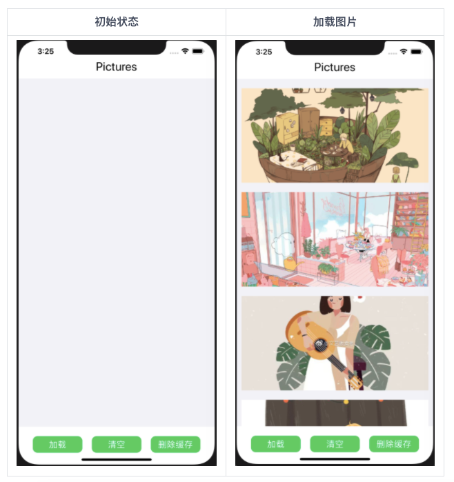
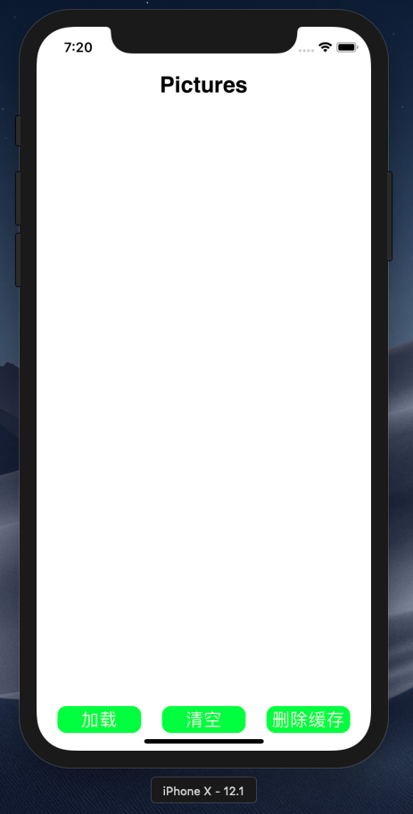
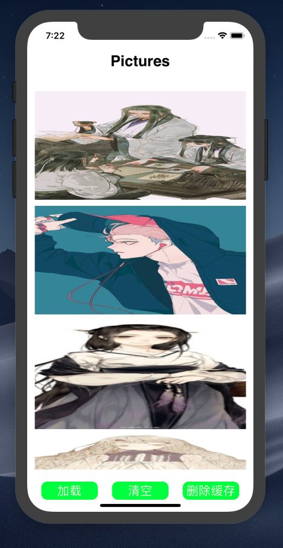

# HW4实验报告
## 介绍
个人作业4 - 多线程和本地存储
## 开发环境
+ Mac OS
+ Objective-C
+ Xcode

**注：项目在xcode的iphone X模拟正常，若出现界面布局大小不合适的情况，请更换模拟设备为iphone X**
## 实验目的
+ 学习使用NSOperation或GCD进行多线程操作
+ 学习iOS沙盒机制，进行文件读写操作
## 项目要求
实现一个简单的图片浏览应用，页面如下：



+ 只有一个页面，包含一个Label，一个图片列表（可以用UICollectionView或UITableView），以及三个按钮（"加载" "清空" "删除缓存"）。
+ 点击"加载"按钮，若Cache中没有缓存的文件，则加载网络图片并显示在图片列表中，要求：
    + 在子线程下载图片，返回主线程更新UI
    + 图片下载完成前，显示loading图标
    + 图片下载后，存入沙盒的Cache中
+ 点击"加载"按钮，若Cache中已存在图片文件，则直接从Cache中读取出图片并显示。
+ 点击"清空"按钮，清空图片列表中的所有图片。
+ 点击"删除缓存"按钮，删除存储在Cache中的图片文件。
## 图片数据
此处使用题目给出的URL:
```
https://hbimg.huabanimg.com/039fe67f0b83b99605374db04fcd4410d10ef135182f2-TJ5VQC_fw658
https://hbimg.huabanimg.com/ad5ef2f1ea4c71ef333c8bcd936102077e6d8ddfe471-lJHmP7_fw658
https://hbimg.huabanimg.com/66ba2e842fbb485b6a155bfb742e73110e745c68612b-4YubTV_fw658
https://hbimg.huabanimg.com/050ad49cece305f1ecfcac4cb3cf301ce7b894dd1d5ea-UN9FgQ_fw658
https://hbimg.huabanimg.com/6a94d8532a265d11b183fdeab7782907d71e90e4ad0c-Q3mC3J_fw658
```
## 关于多线程
+ 声明变量NSOperation，并将selector设置为该线程所需要执行函数：downloadImg。
+ 声明NSOperationQueue，并将1中的NSOperation加入到线程队列中。即可实现多线程的函数调用。

技巧：先将selector设置成一个简单的函数，例如修改UIView的颜色。之后加入到线程队列中，查看运行情况，可以更快的了解IOS线程的运行过程。
## 项目实现
### 页面组件的创建
**使用UILabel创建顶部Label:**
```
-(void)CreateTitle{
    //创建Lable
    CGRect screenBounds = [[UIScreen mainScreen] bounds];
    _title_lable=[[UILabel alloc]initWithFrame:CGRectMake(0, 50, screenBounds.size.width, 30)];
    //设置内容
    _title_lable.text=@"Pictures";
    //设置居中
    _title_lable.textAlignment=NSTextAlignmentCenter;
    //设置字体颜色
    _title_lable.textColor=[UIColor blackColor];
    //设置背景颜色
    _title_lable.backgroundColor=[UIColor whiteColor];
    //设置字体大小
    _title_lable.font = [UIFont fontWithName:@"Helvetica-Bold" size:25];
    
    [self.view addSubview:_title_lable];
}
```
**使用UICollectionView创建图片列表:**使用layout布局类,布局方向为垂直流布局,位置设置采用pods的Masonry库
```
-(void)CreateCol{
    //创建一个layout布局类
    UICollectionViewFlowLayout * layout = [[UICollectionViewFlowLayout alloc]init];
    //设置布局方向为垂直流布局
    layout.scrollDirection = UICollectionViewScrollDirectionVertical;
    //设置每个item的大小
    layout.itemSize = CGSizeMake(500, 180);
    //创建collectionView 通过一个布局策略layout来创建
    self.collectionView = [[UICollectionView alloc]initWithFrame:self.view.frame collectionViewLayout:layout];
    //注册collectionViewCell
    //注意，此处的ReuseIdentifier 必须和 cellForItemAtIndexPath 方法中 一致 均为 cellId
    [self.collectionView registerClass:[Cell class] forCellWithReuseIdentifier:@"cellId"];
    self.collectionView.backgroundColor = [UIColor clearColor];
    self.collectionView.delegate=self;
    self.collectionView.dataSource=self;
    [self.view addSubview:self.collectionView];
    CGRect screenBounds = [[UIScreen mainScreen] bounds];
    [_collectionView mas_makeConstraints:^(MASConstraintMaker *make) {
        make.centerX.mas_equalTo(self.view);
        make.centerY.mas_equalTo(self.view).offset(20);
        make.size.mas_equalTo(CGSizeMake(350, screenBounds.size.height-180));
    }];
}
```
**使用UIButton创建底部三个按钮:**加载、清空、删除缓存三个按钮分别调用Loading、clean、delete三个方法
```
-(void)CreateBtn{
    //创建button
    CGRect screenBounds = [[UIScreen mainScreen] bounds];
    _load_button = [[UIButton alloc] initWithFrame:CGRectMake(screenBounds.size.width/16, screenBounds.size.height-50, screenBounds.size.width/4, 30)];
    _clean_button = [[UIButton alloc] initWithFrame:CGRectMake(3*screenBounds.size.width/8, screenBounds.size.height-50, screenBounds.size.width/4, 30)];
    _delete_button = [[UIButton alloc] initWithFrame:CGRectMake(11*screenBounds.size.width/16, screenBounds.size.height-50, screenBounds.size.width/4, 30)];
    //设置按钮圆角
    [_load_button.layer setCornerRadius:10.0];
    [_clean_button.layer setCornerRadius:10.0];
    [_delete_button.layer setCornerRadius:10.0];
    //设置按钮的背景颜色
    _load_button.backgroundColor = [UIColor greenColor];
    _clean_button.backgroundColor = [UIColor greenColor];
    _delete_button.backgroundColor = [UIColor greenColor];
    //设置文字
    [_load_button setTitle:@"加载" forState:UIControlStateNormal];
    [_clean_button setTitle:@"清空" forState:UIControlStateNormal];
    [_delete_button setTitle:@"删除缓存" forState:UIControlStateNormal];
    //设置文字颜色
    [_load_button setTitleColor:[UIColor whiteColor] forState:UIControlStateNormal];
    [_clean_button setTitleColor:[UIColor whiteColor] forState:UIControlStateNormal];
    [_delete_button setTitleColor:[UIColor whiteColor] forState:UIControlStateNormal];
    //设置字体大小
    _load_button.titleLabel.font = [UIFont systemFontOfSize:20];
    _clean_button.titleLabel.font = [UIFont systemFontOfSize:20];
    _delete_button.titleLabel.font = [UIFont systemFontOfSize:20];
    [self.view addSubview:_load_button];
    [self.view addSubview:_clean_button];
    [self.view addSubview:_delete_button];
    [_load_button addTarget:self action:@selector(Loading) forControlEvents:UIControlEventTouchUpInside];
    [_clean_button addTarget:self action:@selector(clean) forControlEvents:UIControlEventTouchUpInside];
    [_delete_button addTarget:self action:@selector(delete) forControlEvents:UIControlEventTouchUpInside];

}
```
### 逻辑部分的实现
**加载按钮调用的方法Loading:**开启子线程下载图片,图片没全部下载到沙盒的cache时就显示loading图标,等到图片下载完成,从沙盒的cache中读取图片并将图片信息存到picData中,刷新collectionView
```
-(void)Loading{
    NSString *pic=[[NSBundle mainBundle] pathForResource:@"loading" ofType:@"png"];
    if(_isempty){
        NSInvocationOperation *operation = [[NSInvocationOperation alloc]initWithTarget:self selector:@selector(downloadImg) object:nil];
        NSOperationQueue *queue = [[NSOperationQueue alloc]init];
        [queue addOperation:operation];
    }
    while (_isempty) {
        for(int i=0;i<5;i++){
            [_picData replaceObjectAtIndex:i withObject:[NSData dataWithContentsOfFile:pic]];
            [self.collectionView reloadItemsAtIndexPaths:@[[NSIndexPath indexPathForRow:0 inSection:i]]];
        }
    }
    if(!_isempty){
        [self clean];
        NSString *cachesPath=[NSSearchPathForDirectoriesInDomains(NSCachesDirectory, NSUserDomainMask, YES) firstObject];
        NSMutableArray *pic= [[NSMutableArray alloc] initWithCapacity:0];
        [pic removeAllObjects];
        for(int i=0;i<5;i++){
            [pic addObject:[cachesPath stringByAppendingPathComponent:[_url[i] lastPathComponent]]];
            [_picData replaceObjectAtIndex:i withObject:[NSData dataWithContentsOfFile:pic[i]]];
        }
    }
    for(int i=0;i<5;i++){
        [self.collectionView reloadItemsAtIndexPaths:@[[NSIndexPath indexPathForRow:0 inSection:i]]];
    }
}
```
**清空按钮调用的方法clean:**删除picData中存储的图片信息,刷新collectionView,清空图片列表中的所有图片
```
-(void)clean{
    [_picData removeAllObjects];
    for(int i=0;i<5;i++){
        [_picData addObject:[[NSData alloc]init]];
    }
    [_collectionView reloadData];
}
```
**删除缓存按钮调用的方法delete:**删除存储在沙盒的Cache中的图片文件
```
-(void)delete{
    NSArray *cacPath = NSSearchPathForDirectoriesInDomains(NSCachesDirectory, NSUserDomainMask, YES);
    NSString *cachePath = [cacPath objectAtIndex:0];
    NSFileManager *fileManager = [NSFileManager defaultManager];
    for(int i = 0; i < 5; i ++){
        NSString *imageFilePath = [cachePath stringByAppendingPathComponent:[_url[i] lastPathComponent]];
        [fileManager removeItemAtPath:imageFilePath error:nil];
    }
    _isempty=true;
}
```
**子线程中执行的方法downloadImg:**下载图片，存入沙盒的Cache中
```
-(void)downloadImg{
    NSArray *cacPath = NSSearchPathForDirectoriesInDomains(NSCachesDirectory, NSUserDomainMask, YES);
    NSString *cachePath = [cacPath objectAtIndex:0];
    //写入文件
    if (!cachePath) {
        NSLog(@"目录未找到");
    }else {
        NSData *data;
        for(int i=0;i<5;i++){
            NSString *filePaht = [cachePath stringByAppendingPathComponent:[_url[i] lastPathComponent]];
            data=[NSData dataWithContentsOfURL:[NSURL URLWithString:_url[i]]];
            [data writeToFile:filePaht atomically:YES];
        }
        _isempty=false;
    }
}
```
## 效果展示
初始状态、点击清空按钮后界面如下所示:



点击加载按钮待图片加载完成后、加载后点击删除缓存按钮后界面如下所示:

